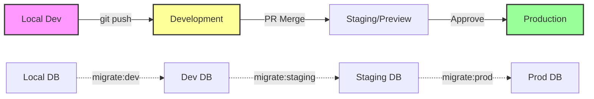

# Deployment Architecture

## Deployment Strategy

**Frontend Deployment:**

- **Local:** Next.js dev server on localhost:3000
- **Development:** Vercel deployment at dev.isla.link
- **Production:** Vercel deployment at app.isla.link
- **Build Command:** `pnpm build --filter=@isla/web`
- **Output Directory:** `apps/web/.next`
- **CDN/Edge:** Vercel Edge Network (global distribution)

**Backend Deployment:**

- **Platform:** Vercel Serverless Functions (all environments)
- **Build Command:** Included in frontend build
- **Deployment Method:** Automatic with frontend

**Admin Dashboard Deployment:**

- **Local:** Separate port (localhost:3001)
- **Development:** admin-dev.isla.link
- **Production:** admin.isla.link
- **Access Control:** IP allowlist + domain restriction

**Database Deployment:**

- **Local:** Supabase CLI (localhost:54321 for API, localhost:54322 for DB)
- **Development:** Supabase Cloud (dev project)
- **Production:** Supabase Cloud (production project)
- **Migration Method:** GitHub Actions + Supabase CLI
- **Backup Strategy:** Daily automated backups (production only)

## CI/CD Pipeline

```yaml
# .github/workflows/ci.yaml
name: CI

on:
  pull_request:
    branches: [main, develop]
  push:
    branches: [main, develop]

env:
  TURBO_TOKEN: ${{ secrets.TURBO_TOKEN }}
  TURBO_TEAM: ${{ secrets.TURBO_TEAM }}

jobs:
  lint-and-type-check:
    runs-on: ubuntu-latest
    steps:
      - uses: actions/checkout@v4

      - uses: pnpm/action-setup@v2
        with:
          version: 8.15.0

      - uses: actions/setup-node@v4
        with:
          node-version: 20
          cache: "pnpm"

      - run: pnpm install --frozen-lockfile

      - run: pnpm lint

      - run: pnpm type-check

  test:
    runs-on: ubuntu-latest
    services:
      postgres:
        image: supabase/postgres:15
        env:
          POSTGRES_PASSWORD: postgres
        options: >-
          --health-cmd pg_isready
          --health-interval 10s
          --health-timeout 5s
          --health-retries 5
        ports:
          - 54322:5432

    steps:
      - uses: actions/checkout@v4

      - uses: pnpm/action-setup@v2
        with:
          version: 8.15.0

      - uses: actions/setup-node@v4
        with:
          node-version: 20
          cache: "pnpm"

      - run: pnpm install --frozen-lockfile

      - name: Setup database
        run: |
          pnpm db:push
          pnpm db:generate

      - run: pnpm test

  # Deploy to development on push to develop branch
  deploy-dev:
    if: github.ref == 'refs/heads/develop'
    runs-on: ubuntu-latest
    environment: development
    needs: [lint-and-type-check, test]
    steps:
      - uses: actions/checkout@v4

      - name: Deploy to Development
        run: |
          vercel --prod --env=development --token=${{ secrets.VERCEL_TOKEN }}

      - name: Run Dev Migrations
        run: |
          supabase link --project-ref ${{ secrets.DEV_SUPABASE_PROJECT_REF }}
          supabase db push --password ${{ secrets.DEV_SUPABASE_DB_PASSWORD }}

  # Deploy to production on push to main branch
  deploy-prod:
    if: github.ref == 'refs/heads/main'
    runs-on: ubuntu-latest
    environment: production
    needs: [lint-and-type-check, test]
    steps:
      - uses: actions/checkout@v4

      - name: Deploy to Production
        run: |
          vercel --prod --token=${{ secrets.VERCEL_TOKEN }}

      - name: Run Production Migrations
        run: |
          supabase link --project-ref ${{ secrets.PROD_SUPABASE_PROJECT_REF }}
          supabase db push --password ${{ secrets.PROD_SUPABASE_DB_PASSWORD }}

      - name: Run Smoke Tests
        run: |
          pnpm test:smoke --url https://app.isla.link
```

## Environments

| Environment | Frontend URL                  | Backend URL               | Database           | Purpose                     |
| ----------- | ----------------------------- | ------------------------- | ------------------ | --------------------------- |
| Local       | http://localhost:3000         | http://localhost:3000/api | Local Supabase CLI | Development & testing       |
| Development | https://dev.isla.link         | https://dev.isla.link/api | Dev Supabase       | Integration testing & demos |
| Preview     | https://pr-{number}.isla.link | Same as frontend          | Branch DB          | PR testing                  |
| Production  | https://app.isla.link         | https://app.isla.link/api | Prod Supabase      | Live environment            |

## Environment Promotion Flow


