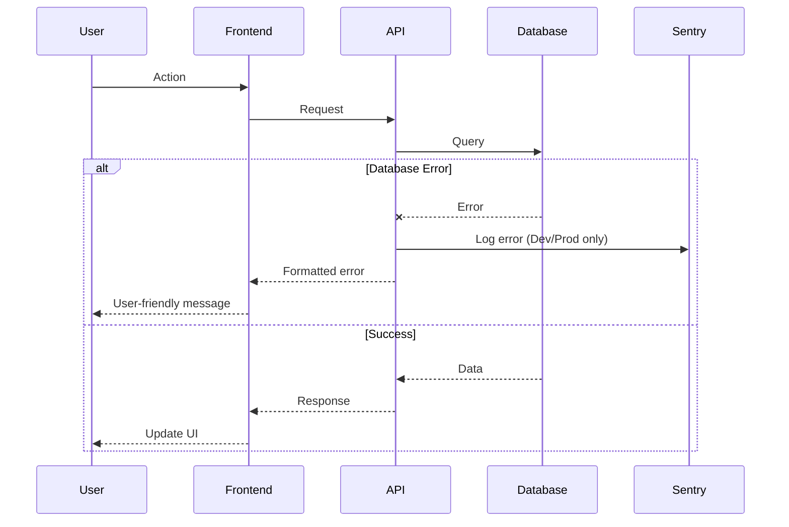

# Error Handling Strategy

## Error Flow



## Error Response Format

```typescript
interface ApiError {
  error: {
    code: string; // Machine-readable error code
    message: string; // User-friendly message
    details?: Record<string, any>;
    timestamp: string;
    requestId: string;
    environment: "local" | "development" | "production";
  };
}
```
