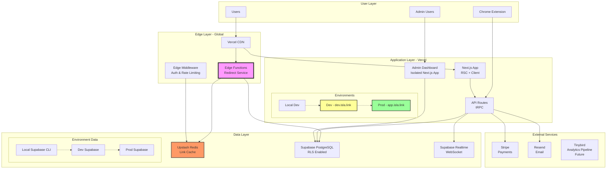

# High Level Architecture

## Technical Summary

The Modern Link Management Platform is a **serverless, edge-optimized monorepo application** built on Next.js 14+ with App Router, deployed globally via Vercel's Edge Network across three environments (Local, Development, Production). The frontend leverages React Server Components with Tailwind CSS and shadcn/ui for a responsive, Notion-like interface. The backend operates through Next.js API routes and Vercel Edge Functions, with Supabase providing PostgreSQL database, authentication, and real-time capabilities. Integration occurs through tRPC for type-safe API calls, WebSocket connections for real-time updates, and Edge Middleware for ultra-fast redirects. The infrastructure runs on Vercel (compute/CDN) with Supabase Cloud (database/auth), Upstash Redis (caching), and achieves PRD goals through edge computing for sub-50ms redirects, materialized views for real-time analytics, and Row Level Security for multi-tenant isolation.

## Platform and Infrastructure Choice

**Platform:** Vercel + Supabase Cloud (3 environments)
**Key Services:**

- Vercel: Edge Functions, KV Storage, Analytics, Web Application Hosting
- Supabase: PostgreSQL Database, Authentication, Real-time Subscriptions, Edge Functions
- Upstash: Redis for link metadata caching, rate limiting
- Resend: Transactional email service
- Stripe: Payment processing and subscriptions

**Deployment Host and Regions:**

- Local: Supabase CLI local development (localhost services)
- Development:
  - Vercel Global Edge Network (dev.isla.link)
  - Supabase US-East-1 (dev project)
  - Upstash Global (dev instance)
- Production:
  - Vercel Global Edge Network (app.isla.link)
  - Supabase US-East-1 (primary), with read replicas planned for EU/APAC post-MVP
  - Upstash Global (multi-region replication)

## Repository Structure

**Structure:** Monorepo with pnpm workspaces
**Monorepo Tool:** Turborepo (proven at scale by Dub.co)
**Package Organization:**

- `apps/web` - Main Next.js application
- `apps/chrome-extension` - Chrome extension (Phase 1)
- `apps/admin` - Standalone admin dashboard (isolated for security)
- `packages/database` - Prisma schema and migrations
- `packages/ui` - Shared React components
- `packages/utils` - Common utilities and helpers
- `packages/types` - Shared TypeScript definitions
- `packages/config` - Shared configuration (ESLint, TypeScript, Tailwind)

## High Level Architecture Diagram

## Architectural Patterns

- **Jamstack Architecture:** Next.js with static generation where possible, API routes for dynamic content - _Rationale:_ Optimal performance with reduced server costs, perfect for marketing pages and dashboards
- **Edge-First Computing:** Redirect logic and auth checks at edge - _Rationale:_ Achieves sub-50ms global redirect latency requirement from PRD
- **Component-Based UI:** Atomic design with shadcn/ui components - _Rationale:_ Rapid development with consistent UX, aligns with "Notion-like" interface goal
- **Repository Pattern:** Data access abstracted through Prisma models - _Rationale:_ Clean separation of concerns, enables future database migration if needed
- **Optimistic UI Updates:** Client-side state updates before server confirmation - _Rationale:_ Instant feedback for users, critical for "real-time" feel
- **CQRS-Lite Pattern:** Separate read models (materialized views) for analytics - _Rationale:_ Handles 10,000+ clicks/day analytics requirement without impacting write performance
- **Multi-tenant RLS:** PostgreSQL Row Level Security for data isolation - _Rationale:_ Secure workspace isolation without complex application logic
- **Event-Driven Analytics:** Click events trigger async processing - _Rationale:_ Non-blocking redirects while capturing comprehensive analytics
- **Cache-Aside Pattern:** Redis cache with PostgreSQL fallback - _Rationale:_ Ensures availability even if cache fails, learned from Dub.co architecture
- **API Gateway via tRPC:** Type-safe RPC calls between frontend and backend - _Rationale:_ Eliminates API versioning issues, provides end-to-end type safety
- **Three-Environment Strategy:** Local → Development → Production - _Rationale:_ Safe testing and staging without affecting production, team collaboration enabled
